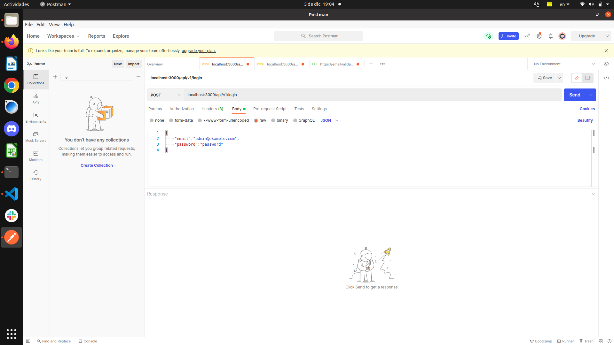

# Instrucciones para Iniciar el Proyecto

## Requisitos Previos

Asegúrate de tener instalado Ruby y Ruby on Rails en tu sistema. Si no los tienes instalados, puedes seguir las instrucciones en la documentación oficial de Ruby on Rails para instalarlos: [Instalación de Ruby on Rails](https://guides.rubyonrails.org/getting_started.html#installing-rails)

## Pasos para Levantar el Proyecto

1. Clona el repositorio de Git en tu máquina local:

   ```bash
   git clone https://github.com/Reim00n/lomi-challenge
   cd lomi-challenge
   ```
2. Ejecuta el siguiente comando para instalar todas las gemas y dependencias del proyecto:

```markdown
bundle install
```

3.Renombra el archivo `.env_example` a `.env` y completa las credenciales necesarias en el archivo `.env`. Este archivo generalmente contiene información sensible como claves de acceso a bases de datos, claves de API, etc. Asegúrate de no compartirlo públicamente.

* Crea la base de datos utilizando el siguiente comando:
  ```
  rails db:create
  ```

Ejecuta las migraciones de la base de datos para crear las tablas necesarias:

```
rails db:migrate

```

Si el proyecto incluye datos de ejemplo, puedes cargarlos utilizando el comando `rails db:seed`:

```
rails db:seed
```

Inicia el servidor de desarrollo de Rails:

```
rails s
```

2. El servidor se ejecutará en `http://localhost:3000`.

## Esquema de la Base de Datos

Puedes encontrar el esquema de la base de datos en el siguiente enlace: [Esquema UML](https://lucid.app/lucidchart/09b8131e-e3f0-471e-aef0-06d6c1125b2d/edit?invitationId=inv_14e6dc7b-76a0-482d-a866-74725871f28c)


Para acceder a la consola de rails ejecutamos

```
rails c
```

Una vez dentro podemos ejecutar los siguientes Querys

Mostrar Clientes

```
Client.first
Client.first.cards
Client.first.purchases

```

Mostrar Compra 

```


Purchase.first
Purchase.first.client
Purchase.first.currency
Purchase.first.purchase_details
Purchase.first.purchase_details.first.product
```

Mostrar Categoria 

Para la tabla categoria lo hice de esta forma ya que de esta forma podra tener cuantas sub categorias sean necesarias, y obtendriamos las categorias padres porque seran las categorias que parent_category = null

```
Category.first
Category.first.child_category
Category.first.child_category.parent_category

```

Mostrar Proveedor

```
Supplier.all
Suplier.first.country
```

Mostrar Producto

para la logica de los productos y los tipos de derivados estaria usando la siguiente estructura 


Productos

tiene un identificador

un producto tiene un nombre                       ejemplo bola de lomo

un producto tiene una marca                       ejemplo newland

un producto tiene una categoria                   ejemplo carne magra

un producto tiene una unidad de medida            ejemplo kilos

un producto tiene un costo                        ejemplo  50mil el kilo

un producto tiene un tipo_iva

un producto tiene proveedor


y si el producto se vende por una unidad especifica carne molida 250 gr

podria crearse una categoria molida la cual su padre es carne vacuna

el nombre del producto seria carne molida 250gr

y la medida seria unidad ya que este producto se vende por paquete


Para verlo por consola podemos usar los siguientes comandos

```
Product.all
Product.first.category
Product.first.brand
Product.first.measure
```

Ademas el projecto cuenta con active admin y con un login para una futura api el cual utiliza simple_token_authentication para generar los tokens


